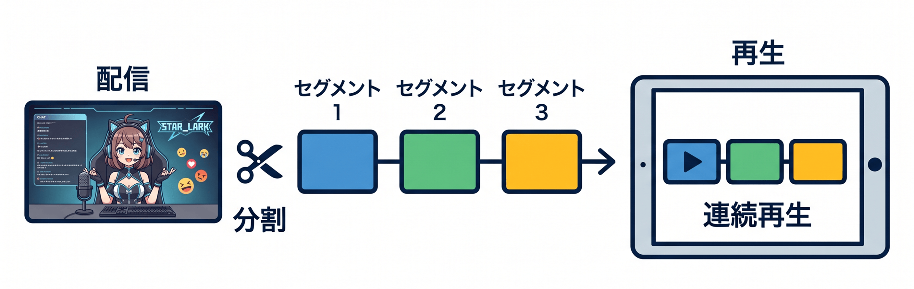
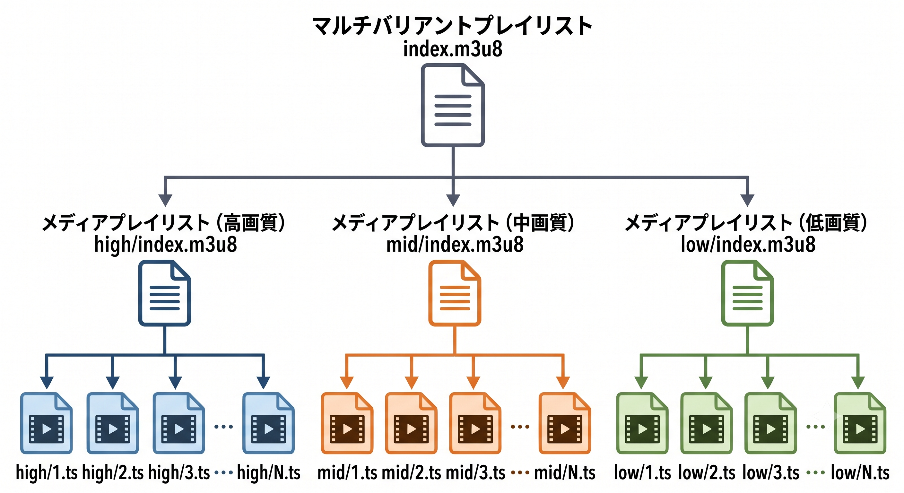
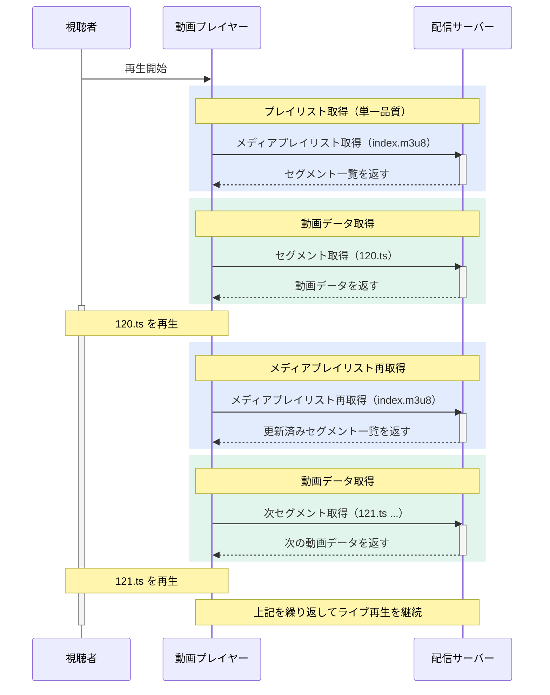
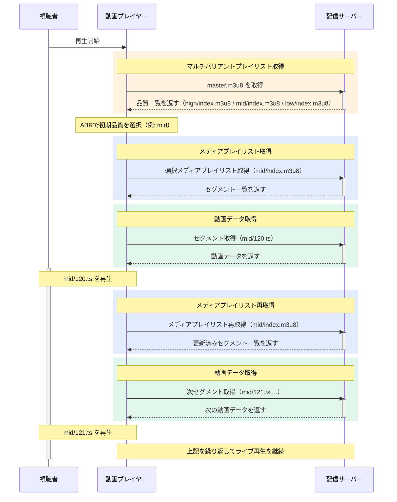
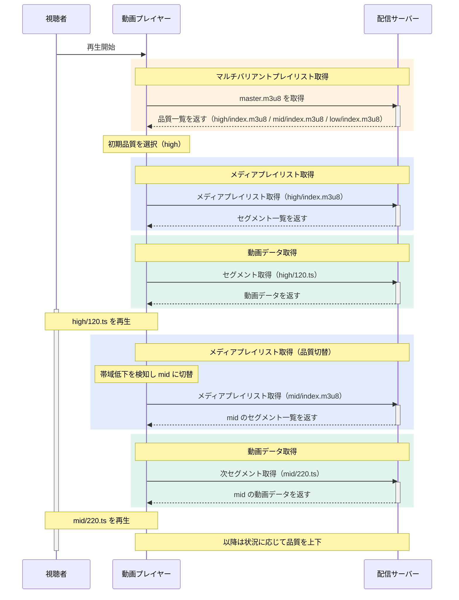
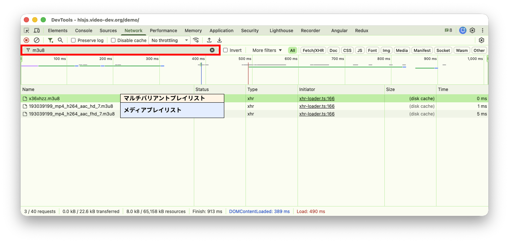
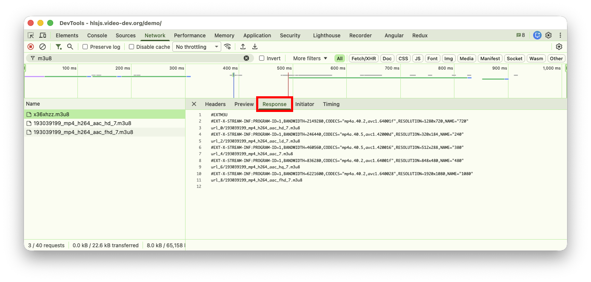
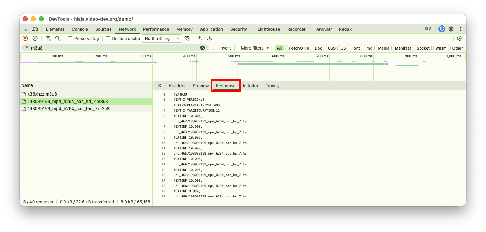
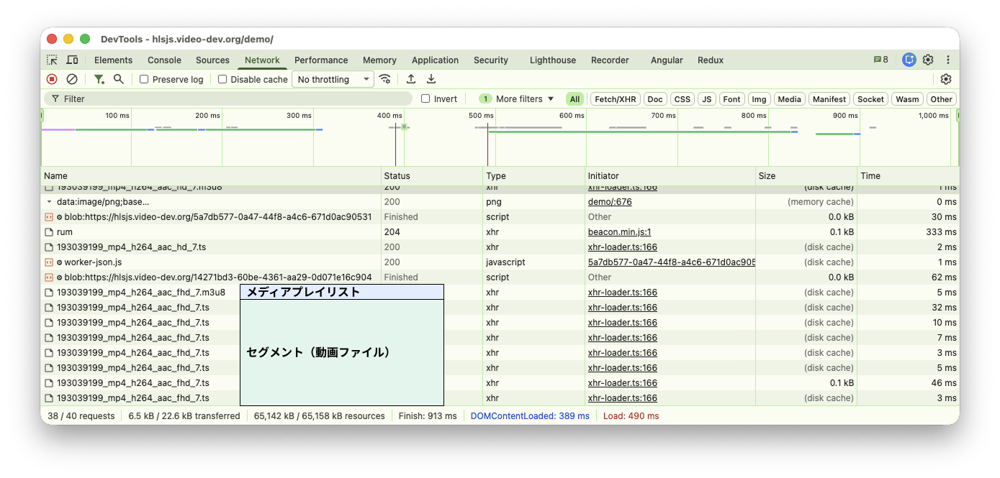
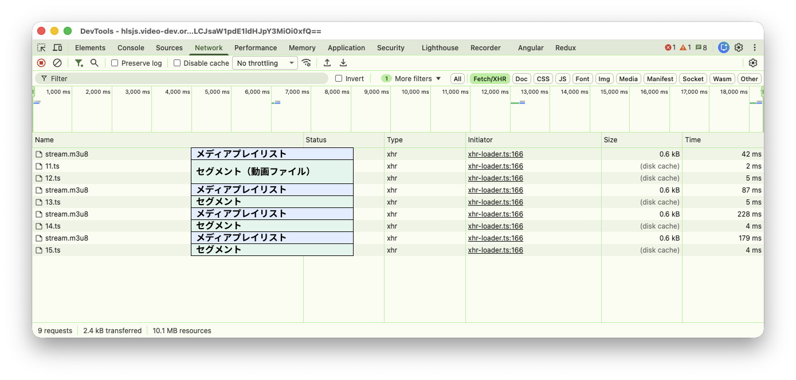

# HLS (HTTP Live Streaming) 解説資料

## 目次

1. [ストリーミング配信とは](#ストリーミング配信とは)
2. [HLSとは](#hlsとは)
3. [HLSの特徴](#hlsの特徴)
4. [HLSの構成要素](#hlsの構成要素)
5. [HLSでの視聴の流れ](#hlsでの視聴の流れ)
6. [実装例](#実装例)
7. [デモページで確認してみよう](#デモページで確認してみよう)
8. [HLS 用のファイルを作ってみよう](#hls-用のファイルを作ってみよう)
9. [他の配信方式](#他の配信方式)
10. [まとめ](#まとめ)

---

## ストリーミング配信とは

動画ファイルの形式として、mp4 をよく聞くと思います。mp4 は、すでに完成された動画を見るときには便利です。  
一方で、ライブ配信のように動画がリアルタイムで増えていく場面では、完成済みの 1 ファイルをそのまま配る方法ではうまく対応できません。

そこで使われるのが、ストリーミング再生という手法です。  
動画を数秒ごとの短い動画ファイルに分割して配信し、再生側ではそれらを順番につなげながら連続再生します。こうした短い動画ファイルは、セグメントと呼ばれます。

セグメントは必要になったタイミングで読み込まれるため、ライブ配信中に新しく増えた映像も、その都度取得しながら再生を続けられます。  
これによって、配信中の動画をリアルタイムに近い形で視聴できます。



今回は、ストリーミング配信の1つである「HLS」に関して説明します！


## HLSとは

[HLS（HTTP Live Streaming）](https://developer.apple.com/streaming/) は、Apple が開発した動画ストリーミング配信方式です。  
ライブ映像を**短い動画**に区切って、順番に取得しながら再生します。

## HLSの特徴

### 1. HTTP ベースの配信

- 配信自体は通常の HTTP 配信で成立する
- 多くのケースで、**Web サーバーや CDN で配信**できる
- 特殊な配信専用プロトコルではなく、普段のWebアクセスと同じリクエスト（主に `GET`）で扱える

### 2. アダプティブビットレート配信（ABR）

- ビットレートは「1秒あたりに送るデータ量（bps）」
- 高ビットレートは高画質だが、通信量が増える
- 低ビットレートは低画質だが、通信量は少ない（止まりにくい）
- ネットワーク状況や再生バッファに応じて品質を切り替えられる
- 最初に品質候補の一覧を見て、状況に合う品質を選ぶ
- 再生中も状況に応じて品質を切り替える

### 3. ライブ配信対応

- プレイリスト（短い動画のリスト）を更新していくことで、配信中の映像をライブ再生できる
- ただし遅延はゼロにはならないため、通常の HLS は秒単位の遅延が発生する

### 4. VOD（ビデオオンデマンド）対応

- あらかじめ録画・エンコード済みの動画を配信する方式
- メディアプレイリストの末尾に `#EXT-X-ENDLIST` タグを入れることで VOD であることを示す
- プレイヤーはリストを更新せず、全セグメントを順番に取得して再生する

---

## HLSの構成要素



### 1. プレイリスト（M3U8）

ABRでは、プレイリストは次の2種類を使います。

- マルチバリアントプレイリスト: 利用可能な品質の一覧
- メディアプレイリスト: 実際の TS セグメント一覧

マルチバリアントプレイリスト例:

```m3u8:index.m3u8
#EXTM3U
#EXT-X-STREAM-INF:BANDWIDTH=4500000,RESOLUTION=1920x1080
high/index.m3u8
#EXT-X-STREAM-INF:BANDWIDTH=2200000,RESOLUTION=1280x720
mid/index.m3u8
#EXT-X-STREAM-INF:BANDWIDTH=800000,RESOLUTION=854x480
low/index.m3u8
```

メディアプレイリスト例:

```m3u8:mid/index.m3u8
#EXTM3U
#EXT-X-VERSION:3
#EXT-X-TARGETDURATION:6
#EXT-X-MEDIA-SEQUENCE:120
#EXTINF:6.0,
120.ts
#EXTINF:6.0,
121.ts
```

上の例で使っている主要タグ:

- `#EXTM3U`: プレイリスト形式の宣言
- `#EXT-X-VERSION`: HLS プレイリストのバージョン
- `#EXT-X-STREAM-INF`: マルチバリアントプレイリスト内で、品質ごとの情報（帯域・解像度など）を示す
- `#EXT-X-TARGETDURATION`: セグメント最大長（秒）
- `#EXT-X-MEDIA-SEQUENCE`: 先頭セグメントの連番
- `#EXTINF`: 直後の TS セグメントの再生時間
- `#EXT-X-ENDLIST`: VOD の末尾を示す（これがあるとプレイヤーはリストを再取得しない）

**ライブ配信でのスライディングウィンドウ**

ライブ配信では、サーバーは古いセグメントをリストから外しながら新しいセグメントを末尾に追加し続けます。
プレイヤーは `#EXT-X-MEDIA-SEQUENCE` を見て「どこまで再生したか」を把握し、新しいセグメントだけを取得します。
この仕組みをスライディングウィンドウと呼びます。

```
時刻 t=0  [120.ts][121.ts][122.ts]
時刻 t=6  [121.ts][122.ts][123.ts]  ← 120.ts が外れ 123.ts が追加
時刻 t=12 [122.ts][123.ts][124.ts]  ← 121.ts が外れ 124.ts が追加
```

### 2. セグメントファイル

- 短い動画断片（一般に 2〜10 秒程度）
- 代表形式は `MPEG-2 TS（.ts）`

---

## HLSでの視聴の流れ

### 1. 単一品質のみ（品質選択なし）



### 2. ABRあり



### 3. 再生途中で品質を切り替える（ABR）



---

## 実装例

Safari はブラウザ標準で HLS をサポートしており、`<video>` タグに `.m3u8` の URL を指定するだけで再生できます。

他のブラウザはネイティブで HLS に対応していないことが多く、またプレイヤーをカスタマイズしたい場合には **[HLS.js](https://github.com/video-dev/hls.js)** が広く使われています。

HLS.js の特徴:

- JavaScript 製のオープンソースライブラリ（Apache 2.0）
- `<script>` タグで CDN から読み込むだけで使える
- ABR による自動品質切替をサポート
- ライブ・VOD どちらにも対応
- Chrome・Firefox・Edge など主要ブラウザで動作

```html
<!doctype html>
<html lang="ja">
<head>
  <meta charset="UTF-8" />
  <title>HLS.js サンプルプレイヤー</title>
  <script src="https://cdn.jsdelivr.net/npm/hls.js@latest"></script>
  <style>
    video { display: block; width: 100%; max-width: 100vw; }
  </style>
</head>
<body>
  <h1>HLS.js サンプルプレイヤー</h1>
  <video id="video" controls></video>

  <script>
    const video = document.getElementById('video');
    const src = 'https://test-streams.mux.dev/x36xhzz/x36xhzz.m3u8';

    if (Hls.isSupported()) {
      const hls = new Hls();
      hls.loadSource(src);
      hls.attachMedia(video);
    }
  </script>
</body>
</html>
```

---

## デモページで確認してみよう

**[https://hlsjs.video-dev.org/demo/](https://hlsjs.video-dev.org/demo/)**

HLS.js 公式のデモページで、ここまで説明した内容を実際に目で確認できます。

### プレイリストとセグメントを見る

デモの中から一番上にある **Big Buck Bunny - adaptive qualities** を選択してください。  
ブラウザの開発者ツール（F12）を開いて、Network タブを開きます。フィルタに `m3u8` を指定して、ページを再読み込みしてみましょう。

いくつか m3u8 ファイルを読み込んでいることが確認できると思います。各行をクリックして Response を見ることで実際のファイルの中身を見ることもできます。



- `x36xhzz.m3u8`: マルチバリアントプレイリスト。品質ごとの m3u8 ファイルのリストが書かれています
  - 
- `193039199_mp4_h264_aac_hd_7.m3u8`等: メディアプレイリスト。セグメント（動画）ファイルのリストが書かれています
  - 

フィルターを外して動画を再生してみると、一定時間で ts ファイルを読み込んでいることが分かると思います。




### ABR（自動品質切替）を見る

ページ下部の **Quality-levels** タブを開くとたくさんのボタンが出てきます。

Currently played level に注目してみると、auto, 0, 1, 2, 3, 4 の選択肢があります。0~4 は品質で `184p / 288p / 480p / 720p / 1080p` の 5品質が並んでいます。  
各ボタンを押すことで現在再生されている動画の品質を切り替えることができます。

### ライブ配信を見る

デモの選択肢から選べる動画は VOD なので、プレイリストを最初に読み込んだあとはセグメントファイルの読み込みだけが行われていました。

一方、ライブ配信では動的にセグメントファイルが増えるので、プレイリストも動的に変わります。
そのため、定期的にプレイリストを取得する必要があるのですが、その様子を見てみましょう。

デモ選択欄の下にある入力欄に、インターン用に用意した配信 URL を指定します。（URL は別途共有します。）

この状態でブラウザの開発者ツールの Network タブを見てみると、定期的にメディアプレイリストが読み込まれているのが分かると思います。



---

## HLS 用のファイルを作ってみよう

[FFmpeg](https://www.ffmpeg.org/) と呼ばれる動画エンコード用のコマンドラインツールを使って、mp4 から HLS の出力（`.m3u8` と `.ts`）を作るデモを行います。

### 準備

- `ffmpeg` が使えること
- 下記サイトから `BigBuckBunny_320x180.mp4` の動画をダウンロードしておくこと  
  https://peach.blender.org/download/


### 変換

入力にダウンロードしてきた動画ファイル、出力先に .m3u8 を指定することで HLS 用のファイルを作成してくれます。

```bash
ffmpeg -i BigBuckBunny_320x180.mp4 index.m3u8
```

### 生成物の確認

変換すると m3u8 と ts ファイルが作成されます。

- `index.m3u8`: メディアプレイリスト
- `stream{数字}.ts`: セグメントファイル（名前は自動で連番になります）

環境にもよりますが、ts ファイル単体でも再生できて、分割された映像になっていることが分かると思います！

---

## 他の配信方式

ライブ配信のための技術は、HLS の他にもたくさんあります。もし興味があれば仕組みを調べてみると面白いと思います！

- **MPEG-DASH**: HLS と同じく HTTP ベースの方式。国際規格として策定されている
- **WebRTC**: P2P（ピア・ツー・ピア）接続を使った超低遅延配信ができる方式。配信と同時に通話・コメント連携などが必要な場面で有効
- **RTMP**: 配信取り込み（OBS などの配信ソフトから配信基盤への入力）で広く使われる方式。視聴するときには HLS などへ変換して使うことが多い
- **SRT**: 不安定なネットワークでも映像を安定転送しやすい方式。リモート会場からの映像中継などで使われる

---

## まとめ

- HLS は、動画をセグメントに分割し、プレイリスト（m3u8）を通じて HTTP で順次配信・再生する方式
- ABR では、マルチバリアントプレイリストで品質候補を示すことで、再生中も通信状況に応じて品質を切り替えられる
- ライブ配信では、メディアプレイリストを更新し続けることで新しい動画も再生し続けられる
- 実装面では、Safari はネイティブ再生が可能ですが、その他のブラウザでは HLS.js などのライブラリを使って実装する必要がある
- HLS はライブ配信の技術の一つで、他にも `MPEG-DASH` や `WebRTC` などがある
---

## 参考文献

- [Apple Streaming (HTTP Live Streaming)](https://developer.apple.com/streaming/)
- [HLS.js - GitHub](https://github.com/video-dev/hls.js)
- [HLS.js Demo](https://hlsjs.video-dev.org/demo/)
- [FFmpeg](https://www.ffmpeg.org/)
- [Big Buck Bunny Downloads (Blender)](https://peach.blender.org/download/)
- [HLS.js CDN (jsDelivr)](https://cdn.jsdelivr.net/npm/hls.js@latest)
- [Mux Test Stream](https://test-streams.mux.dev/x36xhzz/x36xhzz.m3u8)
