# Server-Sent Events (SSE) 入門 — リアルタイム通信のしくみ

> 対象: プログラミングを少しやったことがある人
> 時間: 30分
>
> **必要なもの**: モダンブラウザ（Chrome / Edge / Firefox / Safari）、テキストエディタ（VS Code など）、git。
> OS は Windows / macOS どちらでも OK。最初に git clone する以外、ターミナルは使いません。

今日の30分はこんな流れで進みます:

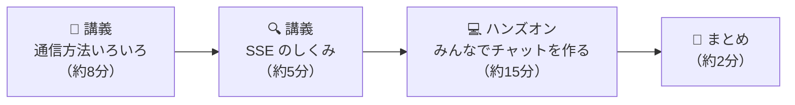

## 目次

- [0. はじめに — チャットはなぜ「勝手に」画面が更新されるのか？](#0-はじめに--チャットはなぜ勝手に画面が更新されるのか)
- [1. 前提のおさらい: クライアントとサーバー（1分）](#1-前提のおさらい-クライアントとサーバー1分)
- [2. サーバーとクライアントの通信方法いろいろ（8分）](#2-サーバーとクライアントの通信方法いろいろ8分)
  - [2-1. 普通の HTTP（リクエスト / レスポンス）](#2-1-普通の-httpリクエスト--レスポンス)
  - [2-2. ポーリング — 何度も聞きに行く](#2-2-ポーリング--何度も聞きに行く)
  - [2-3. ロングポーリング — 返事を保留してもらう](#2-3-ロングポーリング--返事を保留してもらう)
  - [2-4. Server-Sent Events (SSE) — 今日の主役 ⭐](#2-4-server-sent-events-sse--今日の主役-)
  - [2-5. WebSocket — 双方向の本格派（参考）](#2-5-websocket--双方向の本格派参考)
  - [2-6. 4つの方法を並べて比較](#2-6-4つの方法を並べて比較)
- [3. SSE のしくみをのぞいてみる（5分）](#3-sse-のしくみをのぞいてみる5分)
  - [3-1. 正体はただの「終わらない HTTP レスポンス」](#3-1-正体はただの終わらない-http-レスポンス)
  - [3-2. 受け取る側は EventSource — たった3行](#3-2-受け取る側は-eventsource--たった3行)
- [4. ハンズオン: 教室のみんなでリアルタイムチャット（15分）](#4-ハンズオン-教室のみんなでリアルタイムチャット15分)
  - [全体像 — 何がどうつながるのか](#全体像--何がどうつながるのか)
  - [進め方](#進め方)
  - [Step 1. 生の SSE をこの目で見る（3分）](#step-1-生の-sse-をこの目で見る3分)
  - [Step 2. ファイルを準備する（2分）](#step-2-ファイルを準備する2分)
  - [Step 3. メイン課題: EventSource で受信する（7分）](#step-3-メイン課題-eventsource-で受信する7分)
  - [Step 4. 発展課題: メッセージを送信する（3分）](#step-4-発展課題-メッセージを送信する3分)
  - [完成チェック ✅](#完成チェック-)
  - [うまく動かないとき 🔧](#うまく動かないとき-)
  - [追加チャレンジ 🚀（時間が余った人向け）](#追加チャレンジ-時間が余った人向け)
- [5. まとめと発展（2分）](#5-まとめと発展2分)
  - [身近な SSE の実例 🌏](#身近な-sse-の実例-)
  - [さらに学びたい人へ 📚](#さらに学びたい人へ-)
  - [おまけ: サーバーごと手元で動かしてみる 🖥](#おまけ-サーバーごと手元で動かしてみる-)

---

## 0. はじめに — チャットはなぜ「勝手に」画面が更新されるのか？

LINE や Discord などのチャットアプリを思い浮かべてください。相手がメッセージを送ると、**自分は何も操作していないのに**、画面にメッセージがポンと現れますよね。

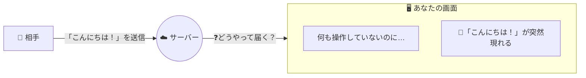

実はこれ、Web の基本のしくみだけでは**できない**ことなんです。

Web の通信は「クライアント（ブラウザ）が聞く → サーバーが答える」の繰り返しでできています。サーバーは**聞かれたことに答えるだけ**の存在で、自分から「新しいメッセージが来たよ！」と教えてはくれません。

では、チャットアプリはどうやってこの壁を乗り越えているのでしょうか？ 今日はその答えのひとつ、**Server-Sent Events（サーバー送信イベント、略して SSE）** を学び、最後は**この講義の全員がつながるリアルタイムチャット**を実際に作ります。

---

## 1. 前提のおさらい: クライアントとサーバー（1分）

先に言葉を2つだけ確認します。Web の世界は、この2人の登場人物の会話でできています。

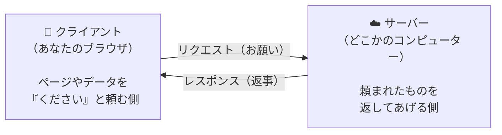

- **クライアント**: サービスを利用する側。今日はみなさんのブラウザです
- **サーバー**: サービスを提供する側。「リクエスト（お願い）」を受けて「レスポンス（返事）」を返します

ポイントは、**会話のきっかけを作れるのは常にクライアント側**だということ。この「一問一答」のルールの上で、どうやってリアルタイム通信を実現するかが今日のテーマです。

---

## 2. サーバーとクライアントの通信方法いろいろ（8分）

リアルタイムに情報を届ける方法を、素朴なものから順に4つ見ていきます。それぞれ「例えるなら何か」とセットで覚えると忘れません。

### 2-1. 普通の HTTP（リクエスト / レスポンス）

> 🍹 **例えるなら: 自動販売機**
> ボタンを押せばジュースが出てくる。でも自販機のほうから「新商品出たよ！」と教えてくれることは絶対にない。

Web の基本形です。クライアントがリクエストを送ると、サーバーがレスポンスを**1回返して、そこで通信は終わり**です。

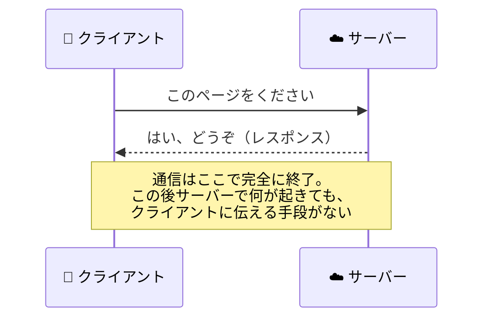

| 👍 良いところ          | 👎 困るところ                      |
| ---------------------- | ---------------------------------- |
| シンプルで分かりやすい | サーバーから話しかけられない       |
| Web のすべての基本     | 新着情報はリロードしないと見えない |

このままでは、チャットの新着メッセージを表示するには**ユーザーが手動でリロードし続ける**しかありません。つらいですね。ここからが工夫の始まりです。

### 2-2. ポーリング — 何度も聞きに行く

> 🚚 **例えるなら: 「荷物まだ？」と何度も電話する人**
> 配達センターに1分おきに電話して「荷物届いてますか？」→「まだです」→（1分後）「届いてますか？」→「まだです」……。

一番素朴な解決策です。クライアントが**一定間隔で自動的に**「新着ある？」と聞きに行きます。リロード連打をプログラムにやらせるイメージです。

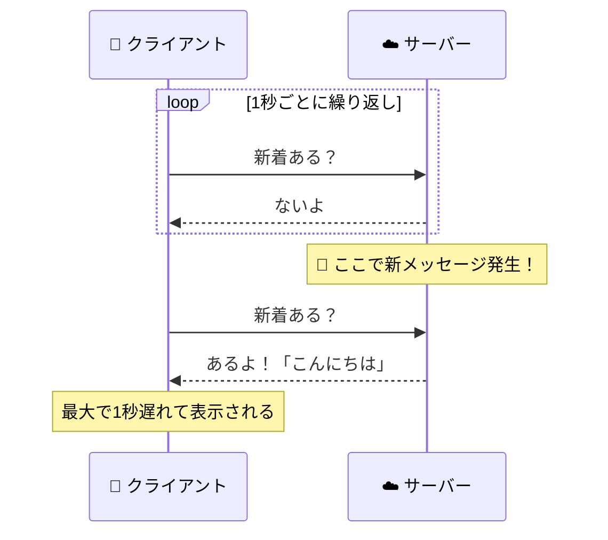

| 👍 良いところ      | 👎 困るところ                                                        |
| ------------------ | -------------------------------------------------------------------- |
| 実装がとても簡単   | 新着がなくても聞き続ける = **通信の無駄が多い**                      |
| どんな環境でも動く | 聞く間隔のぶん**表示が遅れる**（間隔を縮めると無駄が増えるジレンマ） |

### 2-3. ロングポーリング — 返事を保留してもらう

> ☎️ **例えるなら: 電話を保留でつなぎっぱなしにする人**
> 「荷物が届いたら教えて。届くまで電話は切らずに待ってます」。オペレーターは荷物が届いた瞬間に「届きました！」と答える。答えを聞いたら、すぐまた電話をかけ直す。

ポーリングの改良版です。聞き方は同じですが、サーバーが「新着が来るまで**返事を保留**」します。

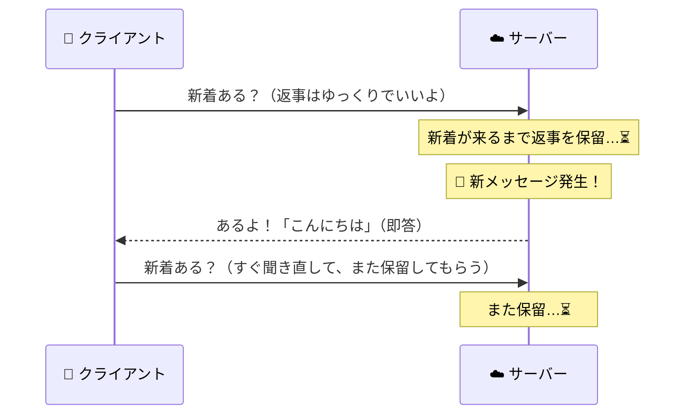

| 👍 良いところ          | 👎 困るところ                        |
| ---------------------- | ------------------------------------ |
| 無駄なやりとりが激減   | サーバー側の実装が複雑になりがち     |
| ほぼリアルタイムで届く | 「答えたらすぐ聞き直す」の管理が面倒 |

だいぶ良くなりました。でも「1回答えたら接続が終わるので、かけ直し続ける」のがまだ不格好です。**最初から接続を切らなければいいのでは？** — それが次の SSE です。

### 2-4. Server-Sent Events (SSE) — 今日の主役 ⭐

> 📻 **例えるなら: ラジオ放送**
> 一度チューニングを合わせたら（= 接続したら）、あとは放送局が好きなタイミングで流す音声がずっと届き続ける。聞く側は受信するだけ。

接続を**つなぎっぱなし**にして、サーバーが**好きなタイミングで何度でも**データを流し込む方法です。

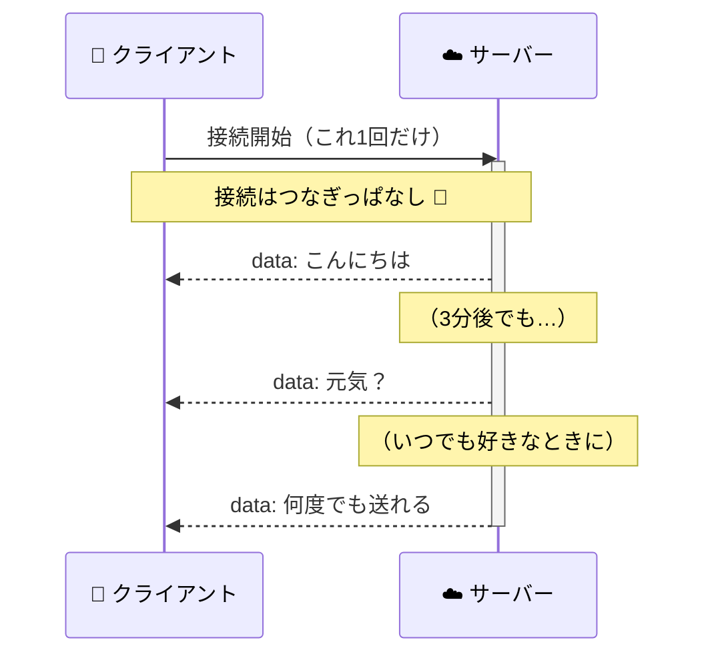

| 👍 良いところ                                            | 👎 注意するところ                                                     |
| -------------------------------------------------------- | --------------------------------------------------------------------- |
| サーバーから**プッシュ**できる（今日やりたかったこと！） | 通信は**サーバー → クライアントの一方向**                             |
| 普通の HTTP の上で動く。特別なプロトコル不要             | クライアント → サーバーは普通の HTTP を併用する（後で実際にやります） |
| 回線が切れても**ブラウザが自動で再接続**してくれる       |                                                                       |

「一方向しか送れないの？」と思うかもしれませんが、心配いりません。クライアント → サーバーは今まで通りの HTTP リクエストで送ればいいだけです。**受信は SSE、送信は普通の HTTP** — この組み合わせが SSE アプリの定番の形で、ハンズオンでもこの形を作ります。

### 2-5. WebSocket — 双方向の本格派（参考）

> 📞 **例えるなら: 電話**
> つながっている間、どちらからでも好きなときに話せる。そのかわり、電話網という専用のしくみが要る。

**双方向**にリアルタイム通信できる方法です。オンラインゲームや共同編集ツール（Google ドキュメントのようなもの）など、クライアント側からも高頻度でデータを送る場面で使われます。

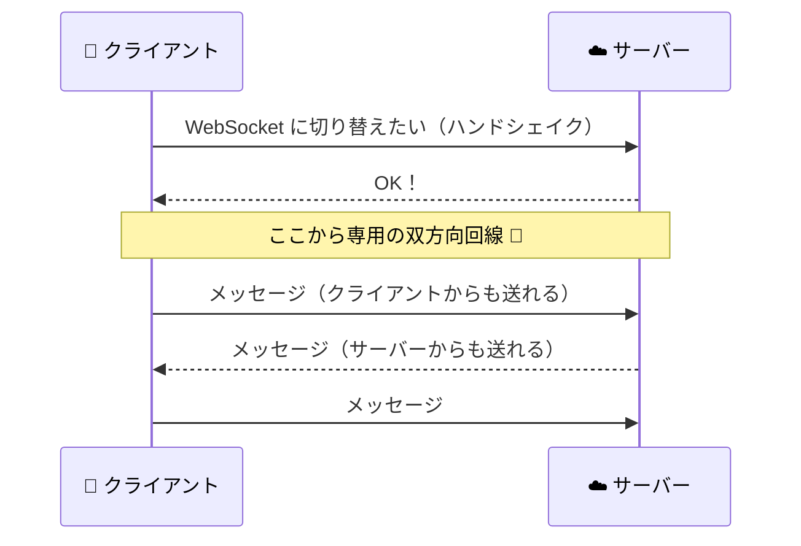

| 👍 良いところ        | 👎 困るところ                                       |
| -------------------- | --------------------------------------------------- |
| 双方向・低遅延で最強 | HTTP とは**別のプロトコル**（しくみが少し大がかり） |
| ゲームにも耐える     | 切断時の再接続は**自分でコードを書く**必要がある    |

### 2-6. 4つの方法を並べて比較

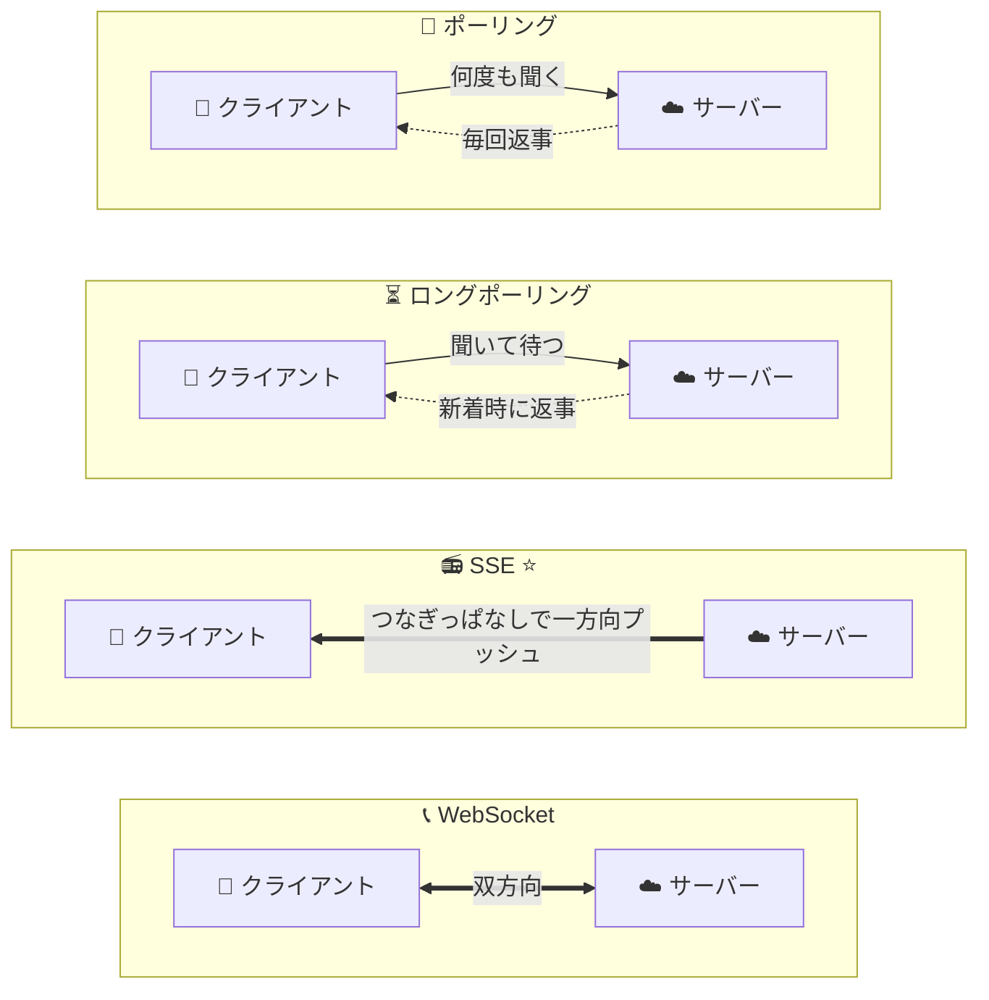

| 方式             | 例え          | 方向                                | リアルタイム性      | 実装の手軽さ | 自動再接続            |
| ---------------- | ------------- | ----------------------------------- | ------------------- | ------------ | --------------------- |
| ポーリング       | 🚚 何度も電話 | クライアント→サーバーの繰り返し     | △（間隔ぶん遅れる） | ◎            | −（毎回新規）         |
| ロングポーリング | ☎️ 保留で待つ | 同上（返事を保留）                  | ○                   | △            | −（自作）             |
| **SSE**          | **📻 ラジオ** | **サーバー→クライアント（一方向）** | **◎**               | **○**        | **◎（ブラウザ標準）** |
| WebSocket        | 📞 電話       | 双方向                              | ◎                   | △            | ✕（自作）             |

**使い分けの目安**: 「サーバーからの通知を受け取りたいだけ」なら SSE で十分。「クライアントからも高頻度で送りたい」（ゲームなど）なら WebSocket。

---

## 3. SSE のしくみをのぞいてみる（5分）

### 3-1. 正体はただの「終わらない HTTP レスポンス」

SSE と聞くと難しそうですが、正体は拍子抜けするほどシンプルです。サーバーは普通の HTTP レスポンスを返します。ただし——

1. レスポンスの種類（`Content-Type`）を `text/event-stream`（イベントの流れ）にする
2. レスポンスを**終わらせない**。新しいデータができるたびに、**続きをちょっとずつ書き足していく**

たったこれだけ。流れてくる中身も、ただのテキストです:

```
data: こんにちは
                          ← 空行（ここまでで1件目）
data: 2件目のメッセージ
                          ← 空行（ここまでで2件目）
data: 複数行を送りたいときは
data: data 行を並べる
                          ← 空行（この2行で1件）
```

書式のルールを図解するとこうです:

```
┌─────────┬──────────────────────────┐
│ data:   │ こんにちは                  │ ← 「data: 」に続けて本文を書く
├─────────┴──────────────────────────┤
│ （空行）                             │ ← 空行 = 「ここまでで1件」の合図
└────────────────────────────────────┘
```

「ただのテキストが流れてくる HTTP レスポンス」なので、**SSE の URL をブラウザのアドレスバーに入れて直接開くだけで、生のストリームをこの目で見る**ことができます。ハンズオンで最初にやってみましょう。

### 3-2. 受け取る側は EventSource — たった3行

「流れてくるテキストを自力で切り分けるの、面倒そう…」と思いましたか？ 大丈夫です。ブラウザには SSE 専用の受信機、[`EventSource`](https://developer.mozilla.org/ja/docs/Web/API/EventSource) が標準で内蔵されています。

```js
// ① 受信機を作って、SSE の URL にチューニングを合わせる
const eventSource = new EventSource("https://サーバーのURL/events");

// ② メッセージが1件届くたびに、この関数が自動で呼ばれる
eventSource.onmessage = (event) => {
  console.log(event.data); // ③ event.data に本文（"data: " の後ろの文字列）が入っている
};
```

コードとデータの対応関係はこうなっています:

```
サーバーが流すテキスト               ブラウザ（EventSource）がやること
─────────────────────            ─────────────────────────────
data: こんにちは          ──────▶  onmessage が呼ばれる
（空行）                            event.data === "こんにちは"

data: 元気？             ──────▶  もう一度 onmessage が呼ばれる
（空行）                            event.data === "元気？"
```

しかも `EventSource` は、面倒な仕事を全部裏で引き受けてくれます:

- 🔌 接続をつなぎっぱなしに維持する
- ✂️ テキストを「空行区切り」で1件ずつに切り分ける
- 🔄 **回線が切れたら自動で再接続する**（これを自分で書くと大変！）

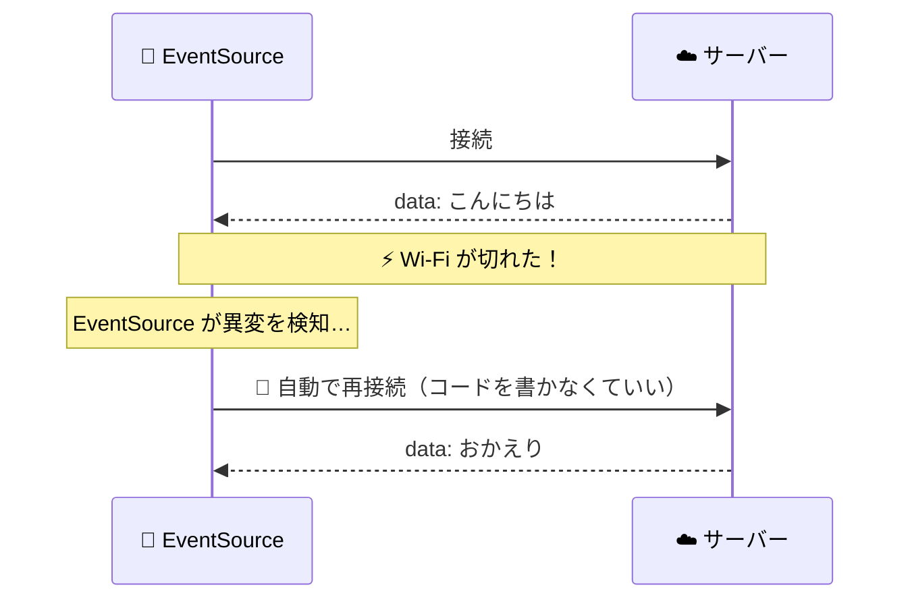

まとめると: **サーバーはテキストを書き足すだけ、ブラウザは `EventSource` で受け取るだけ。** リアルタイム通信のわりに、登場する道具はこれだけです。

---

## 4. ハンズオン: 教室のみんなでリアルタイムチャット（15分）

いよいよ手を動かします。作るのは、**この教室の全員がつながるチャット**です。

サーバーは運営側で用意してデプロイ済みです。**みなさんが書くのはクライアント側（HTML の中の JavaScript）だけ**。書く量はほんの数行です。

> 🌐 **サーバーの URL は講師が案内します。** 以下では `https://サーバーのURL` と書きます。

### 全体像 — 何がどうつながるのか

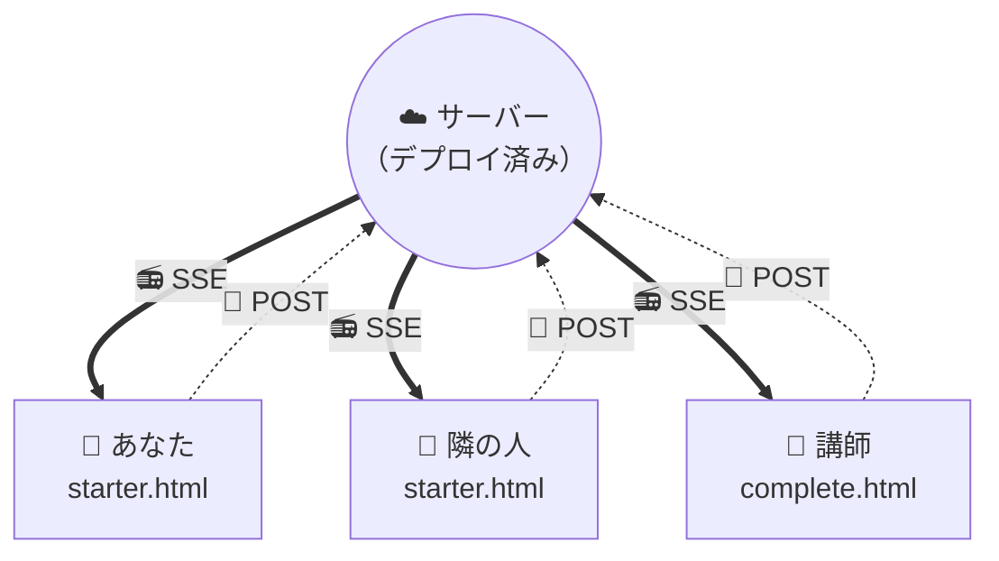

- **📻 SSE**（太線）: サーバーが**全員にプッシュ**
- **📮 POST**（点線）: 送信は**普通の HTTP POST**

誰かひとりが送信すると、サーバーがそれを**接続している全員に SSE でばらまく**、という構造です。時間の流れで見るとこうなります:

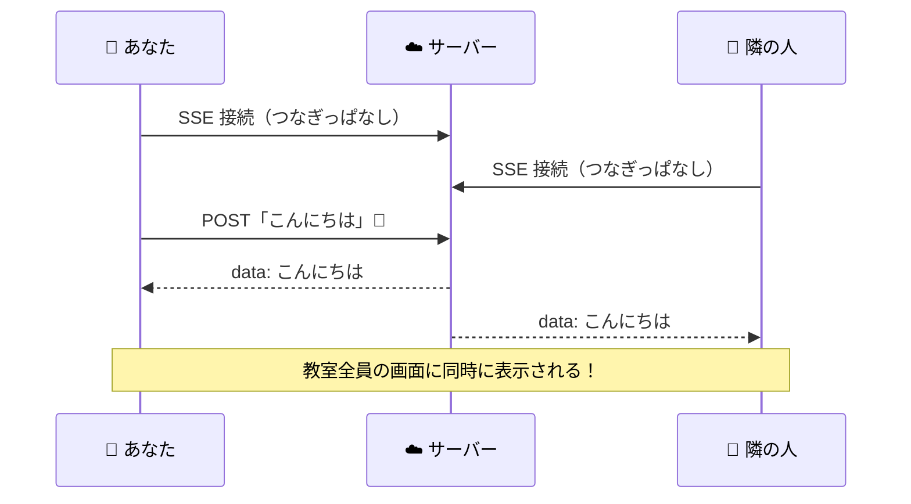

使うしくみは 2章・3章でやった2つだけです:

- **受信** 📻: SSE（`/events` につなぎっぱなし）
- **送信** 📮: 普通の HTTP POST（`/send` に送る）

### 進め方

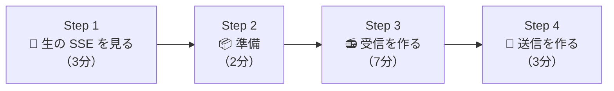

### Step 1. 生の SSE をこの目で見る（3分）

コードを書く前に、3-1 節でやった「SSE = ただのテキストが流れる終わらないレスポンス」を確かめましょう。

**ブラウザの新しいタブで、次の URL を直接開いてください**（アドレスバーに入力）:

```
https://サーバーのURL/events
```

タブがずっと「読み込み中」のままになりますが、**それが正解**です。終わらないレスポンスなのだから、読み込みも終わらないのです。開いた瞬間、画面には `data: 接続しました！` という1行が表示されているはずです（サーバーが接続直後に送ってくれる挨拶です）。

この状態で講師がテストメッセージを送ります。画面にこんな行が**追記されていく**のを見てください:

```
data: こんにちは、SSE！
```

誰かがチャットに送信するたびに、あなたのタブにも1行増えます。**これが SSE の正体、生のストリームです。** 特別な道具がなくても、ブラウザだけで中身が見えてしまうくらいシンプルなんですね。

確認できたらこのタブは閉じて OK です。ここからは、この生テキストを `EventSource` に受け取らせて、ちゃんとした画面にしていきます。まずはファイルの準備から。

### Step 2. ファイルを準備する（2分）

1. このリポジトリを git clone します:

   ```sh
   git clone https://github.com/jigintern/2026-online-1week-template.git
   ```

2. clone したフォルダの中の `docs/sse/handson/starter.html` を**テキストエディタ（VS Code など）で開きます**
3. 同じファイルを**ブラウザでも開きます**（エクスプローラー / Finder でダブルクリックすれば開きます）

ブラウザに「SSE チャット」というタイトルと入力欄が表示されれば準備完了です。ただし**この時点ではまだ何も送れないし届きません**（これから穴を埋めるので）。

4. 最後に、エディタで `starter.html` の上のほうにあるこの行を、講師が案内した URL に書き換えて**保存**しておきます:

```js
const SERVER_URL = "https://サーバーのURL"; // ← 講師が案内する URL に書き換える
```

> ✍️ **これから編集するのは `starter.html` の1ファイルだけ**です。「エディタで直す → 保存 → ブラウザをリロード」のサイクルで進みます。

### Step 3. メイン課題: EventSource で受信する（7分）

エディタで `starter.html` を開くと、こんなコメントの場所があります:

```js
// ✏️ TODO(メイン課題): SSE でサーバーからのメッセージを受け取ろう
```

ここに、3-2 節でやった `EventSource` のコードを書きます。やることは2つ:

1. ``new EventSource(`${SERVER_URL}/events`)`` で SSE の接続を作る
2. `onmessage` で、届いた本文（`event.data`）を `addMessage(event.data)` に渡す

> 💡 `addMessage` は「文字列を渡すと画面のリストに1行追加してくれる関数」で、すぐ下に定義済みです。みなさんは呼ぶだけで OK。
> 💡 `` `${SERVER_URL}/events` `` はテンプレート文字列という書き方で、`SERVER_URL` の中身と `/events` をつなげた URL になります。

<details>
<summary>🔑 答えを見る（まずは自力で書いてみよう！）</summary>

```js
const eventSource = new EventSource(`${SERVER_URL}/events`);
eventSource.onmessage = (event) => {
  addMessage(event.data);
};
```

`new EventSource(...)` で SSE の接続が始まり、メッセージが1件届くたびに `onmessage` に書いた関数が呼ばれます。本文は `event.data` に入っているので、それを `addMessage` に渡せば画面に表示されます。

</details>

書けたら**ファイルを保存して、ブラウザのタブをリロード**します。

**動作確認 ✅**: 正しく書けていれば、リロードした瞬間に「**接続しました！**」がリストに表示されます（サーバーが接続直後に1件送ってくれます）。さらに講師がテストメッセージを流すので、それも表示されたら受信は完璧です。すでに Step 4 まで終えた人のメッセージも流れてくるはずです。

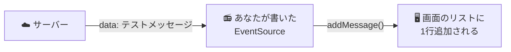

### Step 4. 発展課題: メッセージを送信する（3分）

受信はできましたが、まだ自分からは送れません。`starter.html` の2つ目の穴を埋めます:

```js
// ✏️ TODO(発展): メッセージをサーバーに送ろう
```

やることは1つ。**送信は SSE ではなく、普通の HTTP POST** です（2-4 節で話した「受信は SSE、送信は普通の HTTP」の形ですね）:

- `fetch` で `` `${SERVER_URL}/send` `` に POST する（`body` に入力欄の中身 `input.value` を入れる）

<details>
<summary>🔑 答えを見る（まずは自力で書いてみよう！）</summary>

```js
await fetch(`${SERVER_URL}/send`, {
  method: "POST",
  body: input.value,
});
```

`fetch` の第2引数で `method: "POST"` を指定し、`body` に送りたい文字列を入れます。サーバーはこれを受け取って、接続中の全員に SSE で配信してくれます。

</details>

保存してリロードし、入力欄にメッセージを書いて送信ボタンを押してみてください。**教室の全員の画面にあなたのメッセージが表示されたら完成です！** 🎉

> 💡 詰まったら `docs/sse/handson/complete.html` に完成版があります。自分のコードと見比べてみてください。

### 完成チェック ✅

1. [ ] `starter.html` をブラウザで開くとチャット画面が表示される
2. [ ] 他の人（または講師）が送ったメッセージが、**リロードしなくても**自分の画面に現れる
3. [ ] 自分が送信したメッセージが、**教室全員の画面に**即座に表示される
4. [ ] （余裕があれば）`https://サーバーのURL/events` を別タブで開き、チャットと同じ内容が `data: ...` の生テキストで流れてくるのを確認する

### うまく動かないとき 🔧

| 症状                         | 確認すること                                                                                                                                             |
| ---------------------------- | -------------------------------------------------------------------------------------------------------------------------------------------------------- |
| コードを直したのに変わらない | ファイルを**保存**したか？ ブラウザを**リロード**したか？                                                                                                |
| 何も受信できない             | `SERVER_URL` を講師の案内した URL に書き換えたか？ 末尾に `/` が余分に付いていないか？                                                                   |
| それでも受信できない         | 開発者ツール（F12 / macOS は Option+Cmd+I）の **Console** タブに赤いエラーが出ていないか確認。スペルミス（`EventSource`、`onmessage`）が原因のことが多い |
| 接続できているか見たい       | 開発者ツールの **Network** タブで `events` という行を探す。Type が `eventsource` になっていて、選択すると受信したメッセージ一覧が見られる                |
| 送信できない                 | `fetch` の `method: "POST"` を忘れていないか？ Console にエラーが出ていないか？                                                                          |
| それでも詰まったら           | `docs/sse/handson/complete.html` と自分のコードを見比べる                                                                                                 |

### 追加チャレンジ 🚀（時間が余った人向け）

- **名前付きメッセージ**: 送信時に `JSON.stringify({ name: "自分の名前", text: input.value })` を送り、受信側で `JSON.parse(event.data)` して「名前: 本文」の形で表示する（全員のフォーマットが揃っていなくても、`JSON.parse` に失敗したらそのまま表示する、としておくと安全）
- **自動再接続を観察する**: PC の Wi-Fi を数秒切って戻し、開発者ツールの Network タブで `events` への接続が自動で張り直されるのを見てみる（3-2 節の図が本当に起きます）
- **見た目で遊ぶ**: 自分のメッセージと他人のメッセージで表示の色を変えてみる

---

## 5. まとめと発展（2分）

今日の内容を1枚にするとこうです:

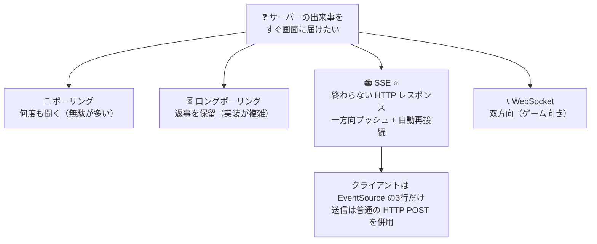

- サーバーからクライアントへ**プッシュ**する方法には、ポーリング / ロングポーリング / SSE / WebSocket がある
- **SSE の正体は「終わらない HTTP レスポンス」**。`data: ...` + 空行というただのテキストを流すだけ。ブラウザで URL を開けば中身が見える
- クライアントは `EventSource` の数行で書けて、**自動再接続**まで付いてくる
- 一方向で足りるなら SSE、双方向・高頻度なら WebSocket

### 身近な SSE の実例 🌏

**ChatGPT や Claude の回答が1文字ずつパラパラ表示されるアレ、実は SSE です。** AI が生成した文字を `data: ...` で少しずつ流しているのです。今日みなさんが書いた `EventSource` と同じしくみが、世界中で毎日使われています。

ほかにも:

- 🔔 Web サービスの通知機能
- 📈 株価やスポーツの実況・ライブ更新
- 🛠 CI/CD のビルドログのリアルタイム表示

「サーバーからの一方向プッシュ」の場面で、SSE は今日も現役です。

### さらに学びたい人へ 📚

- [MDN: Server-Sent Events の利用](https://developer.mozilla.org/ja/docs/Web/API/Server-sent_events/Using_server-sent_events)
- [MDN: EventSource](https://developer.mozilla.org/ja/docs/Web/API/EventSource)
- [MDN: WebSocket API](https://developer.mozilla.org/ja/docs/Web/API/WebSockets_API) — 双方向が必要になったら
- 今日はクライアント側だけを書きましたが、サーバー側も「`data: ...` を書き足し続ける」だけなので意外と簡単です。興味がある人はぜひ自分のサーバーを作ってみてください

### おまけ: サーバーごと手元で動かしてみる 🖥

今日使ったサーバーのコードは、このリポジトリの [`server/`](server/) に入っています。[Deno](https://deno.com/) をインストールすれば、自分の PC だけで一式動かせます:

```sh
cd docs/sse/server
deno run --allow-net --allow-read main.js
```

起動したらブラウザで <http://localhost:8000> を開くと完成版のチャットが表示されます。`http://localhost:8000/events` で生のストリームを見ることもできます。起動方法やしくみの解説は [`server/README.md`](server/README.md) にまとめてあるので、サーバー側がどうやって「終わらないレスポンス」を作っているのか、ぜひコードと合わせて読んでみてください。
