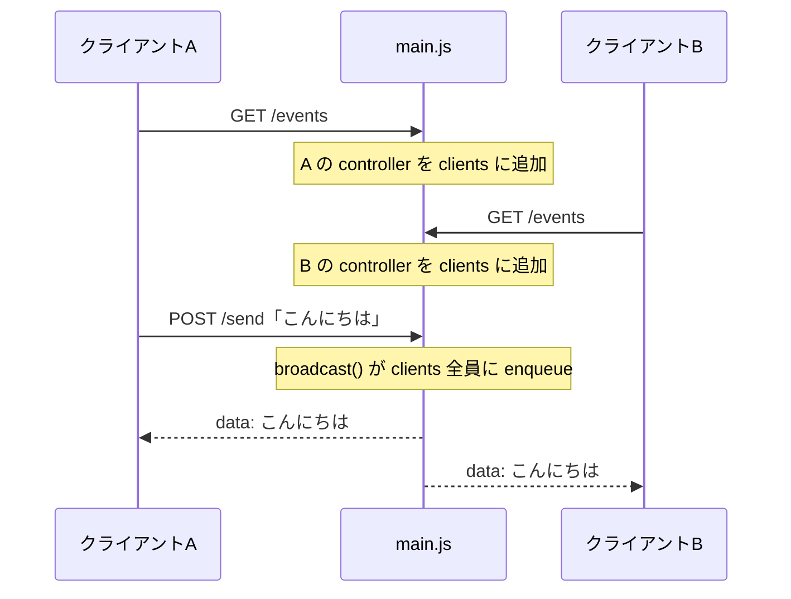

# SSE チャット サーバー（運営向け）

ハンズオン用のサーバー一式です。サーバー本体（`main.js`）と、完成版クライアント（`public/index.html`）が入っています。外部依存はなく、[Deno](https://deno.com/) だけで動きます。

## 起動方法

```sh
cd docs/sse/server
deno run --allow-net --allow-read main.js
```

`Listening on http://0.0.0.0:8000/` と表示されたら起動成功です。ブラウザで <http://localhost:8000> を開くと完成版のチャット画面が出ます。タブを2つ開いて、片方から送ったメッセージが両方に即座に表示されれば正常です。

止めるときは `Ctrl+C`。`AddrInUse` エラーが出る場合は、前に起動したサーバーが残っているので先にそちらを止めてください。

## エンドポイント

| メソッド / パス | 動作 |
|---|---|
| `GET /` | 完成版クライアント（`public/index.html`）を配信 |
| `GET /events` | `text/event-stream` で SSE を配信。接続直後に「接続しました！」を1件送る |
| `POST /send` | リクエストボディの文字列を、接続中の全クライアントにブロードキャスト |

curl での動作確認:

```sh
# 別ターミナルで SSE を受信しつつ…
curl -N localhost:8000/events

# もう1つのターミナルから送信すると、上のターミナルに data: 行が流れる
curl -X POST --data 'テスト' localhost:8000/send
```

## しくみ



- `/events` への接続ごとに `ReadableStream` を作り、その `controller` を `clients`（`Set`）に登録します。レスポンスを終わらせないことで SSE の「つなぎっぱなし」を実現しています
- `POST /send` が来ると `broadcast()` が全 `controller` に `data: <本文>\n\n` を `enqueue` します。改行入りの本文は行ごとに `data:` を付けて SSE フォーマットを守ります
- クライアントが切断すると `cancel()` が呼ばれて `Set` から外れます（`enqueue` に失敗した接続もその場で除去）
- **BroadcastChannel**: Deno Deploy はアクセス状況に応じてサーバーを複数のインスタンスに複製することがあり、`clients` はインスタンスごとに別物になります。そのままだと別インスタンスに接続した受講者にメッセージが届かないため、`POST /send` を受けたインスタンスが [BroadcastChannel](https://docs.deno.com/deploy/api/runtime-broadcast-channel/) で他の全インスタンスにも中継し、各インスタンスが自分の `clients` に配信します。ローカル実行ではインスタンスが1つなので、あってもなくても挙動は変わりません
- **CORS**: ハンズオン受講者は `docs/sse/handson/starter.html` を `file://` で直接開いて接続してくるため、全レスポンスに `Access-Control-Allow-Origin: *` を付けています。これを外すと受講者のブラウザが接続をブロックするので注意

## デプロイ（当日用）

Deno Deploy に `docs/sse/server/main.js` をエントリポイントとして置くだけで動きます。デプロイしたら:

1. ブラウザで `https://<デプロイ先>/events` を開き、`data: 接続しました！` が出ることを確認
2. `https://<デプロイ先>/` のチャットで送受信できることを確認
3. その URL を受講者に案内（受講者は `starter.html` の `SERVER_URL` に設定します）

講義中のテストメッセージは、`https://<デプロイ先>/` の完成版クライアントから送るのが手軽です。
